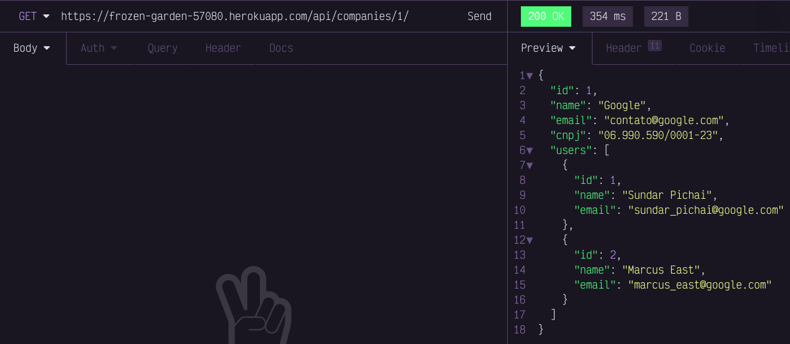

# Teste técnico - Company Hero

Este projeto tem como objetivo expor alguns endpoints por meio de uma API REST para gerenciar
empresas e seus usuários.

A versão final da aplicação está disponível em: https://frozen-garden-57080.herokuapp.com/api/companies/

<small>OBS: Pode ser que no primeiro acesso a requisição demore alguns instantes devido ao recurso de <a href="https://blog.heroku.com/app_sleeping_on_heroku" target="_blank">__asleep__</a> do heroku.</small>

## Tecnologias

As tecnologias usadas na construção da aplicação foram:

- Python
- Django
- Django Rest Framework
- PostgreSQL

## Modelagem dos dados

A aplicação foi modelada com duas entidades:

- Empresa
- Usuário

As duas entidades se relacionam através de uma relação `M-N`, gerando uma nova tabela pivô entre elas.


## Como executar o projeto

A aplicação basicamente precisa do funcionamento de duas partes para o funcionamento correto.

1. Banco de dados postgres executado no docker-compose.
2. Aplicação web executada no Django.

Para executar as duas partes precisam ser instalados o __docker__, __docker-compose__ e __python__.

### Docker

Instale o [docker](https://docs.docker.com/get-docker/).

### Docker Compose

Instale o [docker-compose](https://docs.docker.com/compose/install/).

### Python

Instale o [Python](https://linuxize.com/post/how-to-install-python-3-9-on-ubuntu-20-04/).

### Execução da aplicação

1. No diretório `root` crie o ambiente virtual para instalar as __dependências do projeto__:
    ```bash
    python -m venv env
    ```

2. Ative o __ambiente virtual__ do projeto:
    ```bash
    source ./env/bin/activate
    ```

3. Instale as dependências do projeto:
    ```bash
    python -m pip install -r requirements.txt
    ```

4. Suba o serviço de __banco de dados__:
   ```bash
    docker-compose up -d
    ```
    <small>Obs: A porta __5432__ da aplicação precisa estar liberada para o funcionando do __postgres__.</small>

5. Aplique as __migrations__:
    ```bash
      python src/manage.py makemigrations
      python src/manage.py migrate
    ```
6. Execute a aplicação __Django__:
    ```bash
      python src/manage.py runserver 0.0.0.0:8080
    ```
    <small>Obs: A porta __8080__ da aplicação precisa estar liberada.</small>

### Execução dos testes unitários e de integração

1. Execute:
    ```bash
      python src/manage.py test api
    ```

## Endpoints da aplicação

A aplicação possui quatro endpoints para gerenciar as duas entidades:

- `POST /api/companies/`: Cria uma empresa

> Content-Type: application/json


```json
{
	"name": "Google",
	"email": "contato@google.com",
	"cnpj": "06.990.590/0001-23"
}
```

- `POST /api/companies/:id/users/`: Cria um usuário

> Content-Type: application/json


```json
{
	"name": "Sundar Pichai",
	"email": "sundar_pichai@google.com"
}
```

- `GET /api/companies/:id/`: Obtém uma empresa



- `GET /api/users/?email=email@email.com`: Obtém um usuário por email


